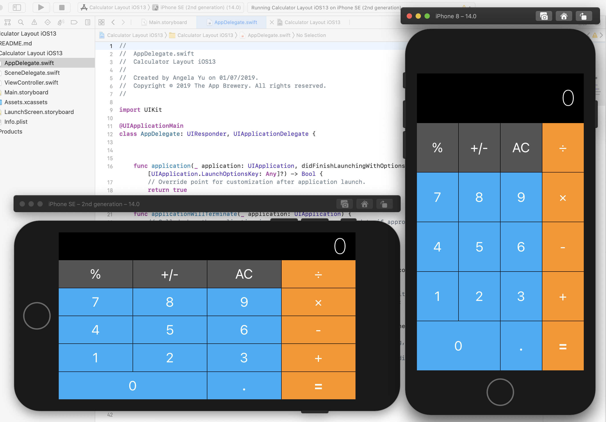

# Calculator Layout
Projeto de layout da calculadora do iPhone para os modos Portrait e Landscape
Projeto criado sob a orientação do curso The App Brewery https://www.appbrewery.co

# Instalação
1 - Clone o projeto:
git clone git@github.com:manoelfilho/calculadora-swift5.git

2 - Abra o arquivo Calculator Layout iOS13.xcodeproj no XCODE
3 - Selecione o simulador e execute o código com COMMAND + R

# Calculator Layout
IPhone calculator layout design for Portrait and Landscape modes
Project created under the guidance of The App Brewery course https://www.appbrewery.co

